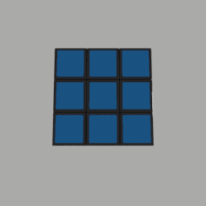
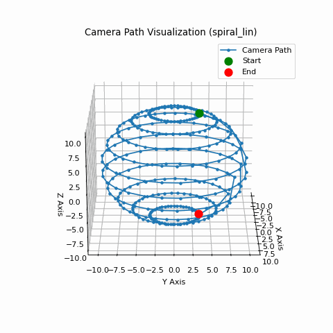

# **PyBlenderRender**
**A modular Python-based rendering pipeline for Blender, designed for automated camera positioning and rendering of 3D models.**

## **Features**

- Modular configuration for camera, lighting, and rendering
- Multiple camera path generation techniques (Spiral, Pole Rotation, Cube, etc.)
- Blender Python API for high-quality 3D rendering
- Extensible architecture for custom camera paths and lighting setups

---

## **Installation**

### **Prerequisites**

- Python 3.7 or later
- Blender Python API 4.0 or later

### **Install Dependencies**

Clone the repository and install the required dependencies:

```bash
git clone https://github.com/spa-dev/PyBlenderRender.git  
cd PyBlenderRender  
pip install .  
```

---

## **Usage**

### **1. Basic Example: Render with Default Settings**

```python
from src.renderer.model_renderer import ModelRenderer

renderer = ModelRenderer()  # Uses default configs
renderer.render()  # Runs rendering pipeline
```

### **2. Custom Camera Configuration**

```python
from src.renderer.config.camera_config import CameraConfig
from src.renderer.model_renderer import ModelRenderer

custom_camera = CameraConfig(
    distance=15.0, 
    camera_density=30, 
    path_type=CameraPathType.SPIRAL_PHI
)

renderer = ModelRenderer(camera_config=custom_camera)
renderer.render()
```
---
 
## **Examples**

### Orbit Camera Path  
The following GIF was created using `make_gif.py` from a sequence of PNG images generated by PyBlenderRender. The model is Rubik's Cube by BeyondDigital (see Attributions below) and script is located at:  
📂 `PyBlenderRender/scripts/make_gif.py`  

**Orbit Camera Path Animation:**  
  

---

### 3D Path Visualization  
This GIF is an animated visualization of a **3D camera path** created from `visualize_path.ipynb`. The notebook is located at:  
📂 `PyBlenderRender/notebooks/visualize_path.ipynb`  

**Spiral Linear Camera Path:**  
  

---

## **Project Structure**

```
PyBlenderRender/
├── README.md
├── setup.py
├── requirements.txt
├── src/
│   ├── renderer/
│   │   ├── model_renderer.py         # Main rendering logic
│   │   ├── config/                   # Configuration classes
│   │   ├── camera/                   # Camera path logic
│   │   ├── lighting/                 # Lighting setups
│   │   └── utils/                    # Utilities (logging, etc.)
│   └── __init__.py
├── tests/                            # Unit tests
├── notebooks/                        # Jupyter Notebooks for experiments
│   ├── visualize_path.ipynb          # Camera path visualization
├── scripts/                          # Utility scripts
├── docs/                             # Documentation
└── .gitignore
```

---

## **Known Issues**

### Camera Distance Variability in CameraPathType.CUBE

With the CUBE camera path type, the bottom view appears closer than others.  
This issue is possibly related to object tracking issues, where the Track  
To constraint might be influencing the final camera position in unexpected  
ways, especially at extreme elevations.

### Light Energy Calculation Inconsistencies

Light energy calculation does not account for all possible light types  
consistently. Try varying `light_intensity` in `LightingConfig` until you  
reach a suitable level.

---

## **Roadmap**

- Multiprocessing – Improve performance by parallel processing of rendering

---

## **Extending the Project**

Want to add a custom camera path?

1. Create a new file in `src/renderer/camera/paths/`, e.g., `custom_path.py`.
2. Subclass `CameraPathGenerator` and implement `generate_positions()`.
3. Register it in `camera/registry.py`.

---

## **Contributing**

Contributions are welcome! Feel free to submit issues or pull requests. 
This project is a low priority for me, so please accept my apologies in
advance for slow responses.

---

## Attributions

The test model is used under the Creative Commons Attribution 4.0 License:

- **Rubik's Cube** (https://skfb.ly/opCGZ) by BeyondDigital  
  Licensed under Creative Commons Attribution (CC BY 4.0)  
  [License Details](http://creativecommons.org/licenses/by/4.0/)

---

## **License**

📜 MIT License – Free to use and modify. Test model is under CC BY 4.0 (see above).

